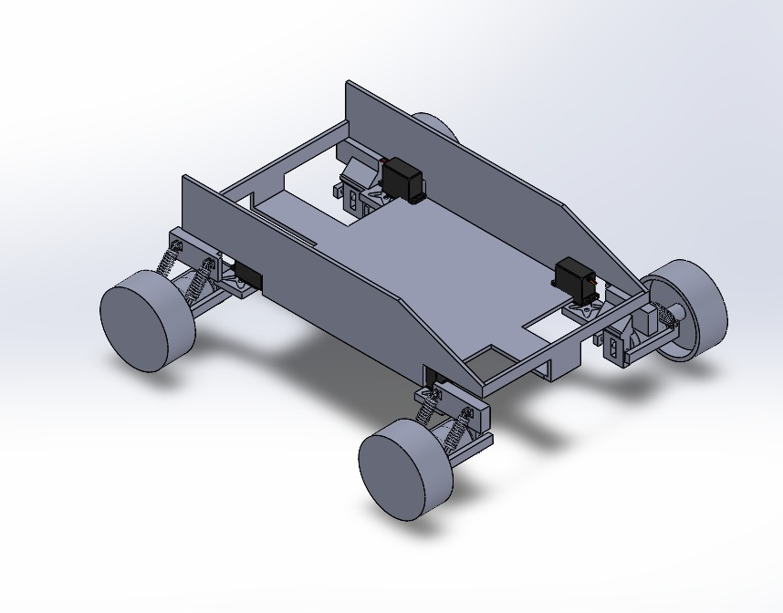
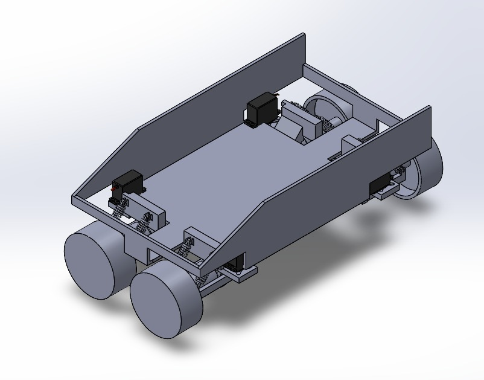

# GC-Hamo-2025
## Video Demo

## Circuit Design
**Transmitter** & **Receiver**

## CAD Design
[Link to CAD files](https://drive.google.com/drive/folders/1ofq2GxQTMj-k_FqcCt4ODpRAtsVdMHEt?usp=drive_link)

|  |  |
|:--------------------------------------------------:|:--------------------------------------------------:|
| **Mode 1: Driving** | **Mode 2: Parallel Parking** |

### Electronics Team
- Aritra
- Aryarup
- Debmalya
- Utsab
### Mech Team
- Shayantan
- Priyavrat
- Kunal
